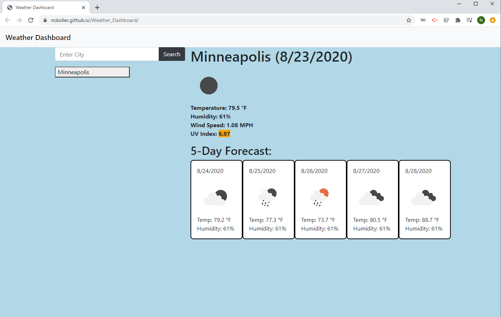

# Weather_Dashboard

This app allows you to search for the weather of major cities and see their current weather conditions and a 5 day forecast.

## URL to live site

<https://nckoller.github.io/Weather_Dashboard/>

## Demonstration Image of App

## Tech Stack

HTML\
JavaScript\
jQuery\
Bootstrap\
Moment.js\
Open Weather API

## Credits

I created this code based on the homework prompt created by Trilogy Education Services.
